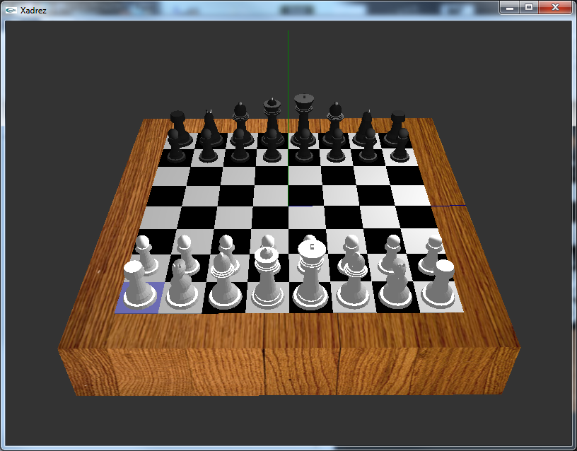
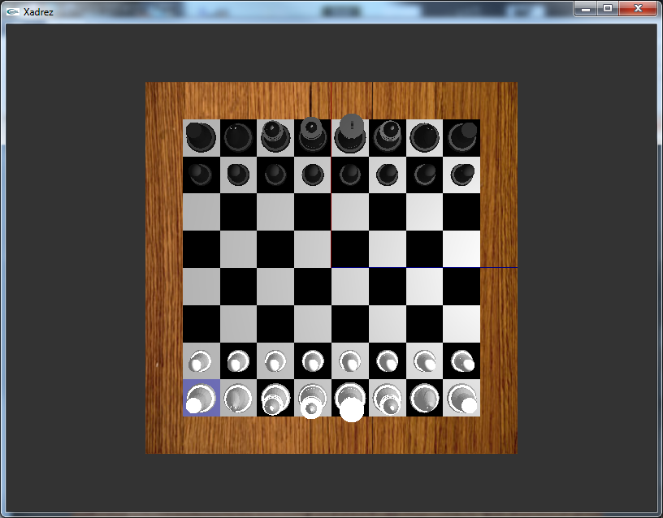
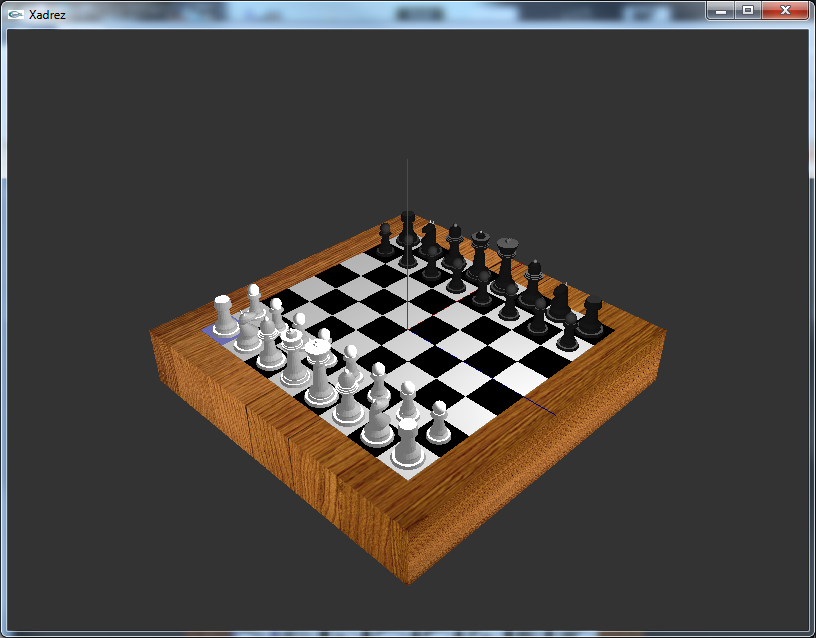
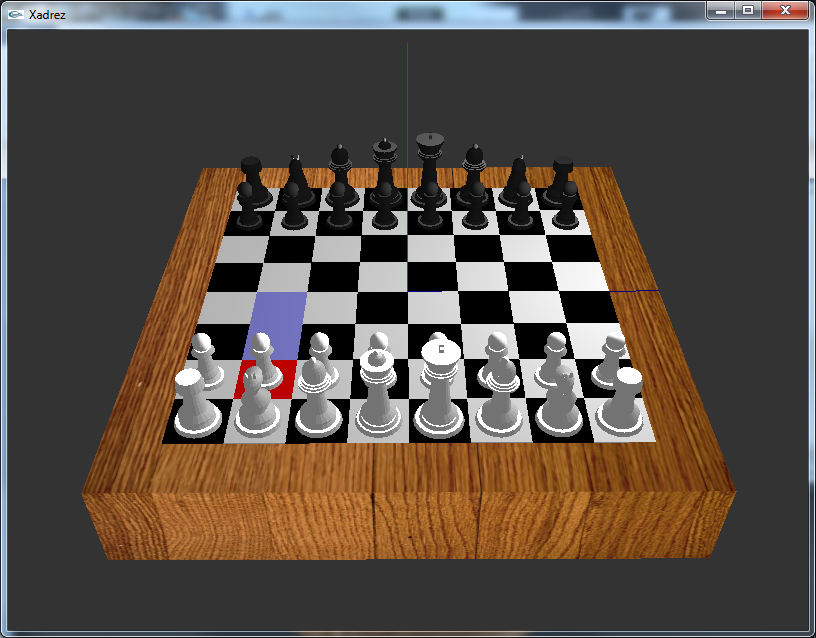

# ♟️ Projeto Xadrez

Projeto desenvolvido em C++ como trabalho Academico da cadeira de Computação Grafica. Utiliza OpenGL para gráficos (via FreeGLUT) e OpenAL para reprodução de som (via freealut). Este repositório foi adaptado para funcionar com o Visual Studio e o gestor de pacotes `vcpkg`.

---

## 📋 Requisitos

- [Visual Studio 2019 ou superior](https://visualstudio.microsoft.com/)
- [vcpkg](https://github.com/microsoft/vcpkg)
- Git (opcional, mas recomendado)

---

## 📦 Bibliotecas utilizadas

- `freeglut` – interface com OpenGL (janelas, input, etc.)
- `openal-soft` – áudio 3D
- `freealut` – utilitário para carregar ficheiros de som

---

---

## ▶️ Executar o jogo sem compilar

Se não quiseres compilar o projeto, podes usar o executável já gerado:

🔗 [Download do executável e DLLs](release-binaries/)

📂 Esta pasta contém:
- `Xadrez.exe`
- `freeglut.dll`
- `OpenAL32.dll`
- `alut.dll`

⚠️ Garante que todos os ficheiros estão na **mesma pasta** antes de executar o `.exe`.

---

## 🚀 Instalação

### 1. Clonar este repositório ou extrair o ZIP

```bash
git clone https://github.com/LuisCoder/Xadrez.git
cd Xadrez
```

### 2. Instalar o vcpkg (se ainda não tiveres)

```bash
git clone https://github.com/microsoft/vcpkg.git
cd vcpkg
.\bootstrap-vcpkg.bat
```

### 3. Integrar com o Visual Studio

```bash
.\vcpkg integrate install
```

### 4. Instalar as dependências do projeto

```bash
.\vcpkg install freeglut:x86-windows
.\vcpkg install openal-soft:x86-windows
.\vcpkg install freealut:x86-windows
```

---

## 🛠️ Compilação

1. Abre o ficheiro `Xadrez.sln` no Visual Studio.
2. Verifica que a plataforma está em `Win32` (x86) e a configuração em `Debug` ou `Release`.
3. Compila o projeto (`Ctrl+Shift+B` ou `Build > Build Solution`).

---

## ⚠️ DLLs necessárias

Depois de compilar, o `.exe` gerado precisa de algumas DLLs que estão na pasta do `vcpkg`:

- `freeglut.dll`
- `OpenAL32.dll`
- `alut.dll`

📂 Copia estes ficheiros de:

```
[vcpkg]\installed\x86-windows\bin\
```

Para a mesma pasta onde está o teu `Xadrez.exe` (normalmente `Debug/` ou `Release/`).

---

## 🛠️ Configuração manual (caso a integração com `vcpkg` não funcione)

Se o Visual Studio não encontrar automaticamente as bibliotecas (`.h` e `.lib`), podes configurar os caminhos manualmente:

1. **Botão direito no projeto → Properties**
2. Em `Configuration Properties > C/C++ > General > Additional Include Directories` adiciona:

```
C:\caminho\para\vcpkg\installed\x86-windows\include
```

3. Em `Linker > General > Additional Library Directories` adiciona:

```
C:\caminho\para\vcpkg\installed\x86-windows\lib
```

4. Em `Linker > Input > Additional Dependencies` adiciona (ou confirma):

```
freeglut.lib;OpenAL32.lib;alut.lib;
```

---




